# 🚀 ollacode

**Lightweight CLI Coding Assistant — Ollama + Telegram**

A local AI coding assistant powered by `qwen3-coder:30b` via Ollama. Chat with your code through the terminal or Telegram — read files, edit code, search your codebase, and run commands, all through natural language.

## ✨ Features

- 🖥️ **CLI Mode** — Rich markdown rendering, code highlighting, real-time streaming
- 📱 **Telegram Mode** — Use your coding assistant remotely from anywhere
- ✏️ **Diff-based Editing** — Smart search/replace file modifications (not full overwrites)
- 🔍 **Code Search** — Grep-like content search across your project
- 📁 **File Operations** — Read, write, search files with workspace sandboxing
- ⚙️ **Command Execution** — Run shell commands with timeout protection
- 🔐 **Approval System** — Review diffs before file changes are applied
- 📋 **Project Memory** — Auto-loads `OLLACODE.md` for project-specific context
- 🔄 **Agentic Loop** — Automatic read → edit → verify → fix cycles (up to 10 iterations)
- 💬 **Conversation Context** — Maintains chat history within sessions

## 🏗️ Architecture

```mermaid
graph TD
    CLI["🖥️ CLI - Rich<br/>Streaming + Approval UI"] --> Engine
    TG["📱 Telegram Bot<br/>Per-user Sessions"] --> Engine
    Engine["⚙️ Conversation Engine<br/>History | Tool Orchestration<br/>Agentic Loop | Project Memory"]
    Engine --> Ollama["🔗 Ollama Client<br/>httpx async"]
    Engine --> Tools["🛠️ Tool System<br/>7 tools"]
    Engine --> Prompts["📋 System Prompt<br/>+ OLLACODE.md Memory"]
    Ollama --> Server["🧠 Ollama Server<br/>localhost:11434<br/>qwen3-coder:30b"]

    style CLI fill:#4a9eff,stroke:#2d7cd4,color:#fff
    style TG fill:#0088cc,stroke:#006699,color:#fff
    style Engine fill:#9b59b6,stroke:#7d3c98,color:#fff
    style Ollama fill:#e67e22,stroke:#d35400,color:#fff
    style Tools fill:#27ae60,stroke:#1e8449,color:#fff
    style Prompts fill:#f39c12,stroke:#d68910,color:#fff
    style Server fill:#2c3e50,stroke:#1a252f,color:#fff
```



## 📦 Installation

```bash
# Clone the repo
git clone https://github.com/rockyRunner-ai/ollacode.git
cd ollacode

# Create virtual environment and install
python3 -m venv .venv
source .venv/bin/activate
pip install -e .

# Configure
cp .env.example .env
# Edit .env with your settings
```

## 🔧 Prerequisites

1. **Ollama** installed with your model:
   ```bash
   ollama pull qwen3-coder:30b
   ollama serve
   ```

2. **Telegram Bot** (optional):
   - Create a bot via [@BotFather](https://t.me/BotFather)
   - Set `TELEGRAM_BOT_TOKEN` in `.env`
   - Set `TELEGRAM_ALLOWED_USERS` with your User ID

## 🚀 Usage

### CLI Mode

```bash
ollacode cli                  # With approval prompts
ollacode cli --auto-approve   # Auto-approve all tool actions
```

### Telegram Mode

```bash
ollacode telegram
```

### Use a Different Model

```bash
ollacode cli --model llama3.1:8b
```

## 📌 CLI Commands

| Command | Description |
|---------|-------------|
| `/help` | Show help |
| `/clear` | Reset conversation |
| `/model` | Show model info |
| `/approve` | Toggle auto-approve mode |
| `/quit` | Exit |

## 🛠️ Available Tools

The AI can use these tools to interact with your system:

| Tool | Description |
|------|-------------|
| `read_file` | Read file contents with line numbers |
| `write_file` | Create new files |
| `edit_file` | Modify existing files via search/replace |
| `list_directory` | List directory contents |
| `search_files` | Find files by glob pattern |
| `grep_search` | Search file contents (like grep) |
| `run_command` | Execute shell commands |

## 📋 Project Memory

Create an `OLLACODE.md` file in your workspace root to provide project-specific context:

```markdown
# Project Rules
- Python 3.12, type hints required
- Use pytest for testing
- Follow PEP 8 style guide
- Database: PostgreSQL with SQLAlchemy
```

This is automatically loaded into every conversation session.

## ⚙️ Environment Variables

| Variable | Default | Description |
|----------|---------|-------------|
| `OLLAMA_HOST` | `http://localhost:11434` | Ollama server URL |
| `OLLAMA_MODEL` | `qwen3-coder:30b` | Model to use |
| `TELEGRAM_BOT_TOKEN` | — | Telegram bot token |
| `TELEGRAM_ALLOWED_USERS` | — | Allowed user IDs (comma-separated) |
| `WORKSPACE_DIR` | `.` | Working directory for tools |

## 📄 License

MIT
